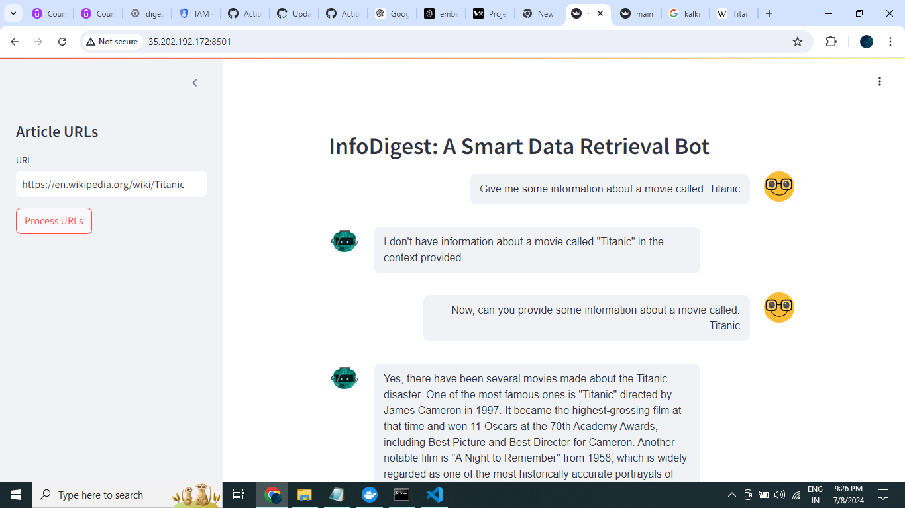

# InfoDigest: A Smart Data Retrieval Bot

**InfoDigest** is an intelligent chatbot that ingests data from URLs and uses LangChain to save it in a vector database. It then retrieves relevant documents from the vector database and queries an LLM (Large Language Model) for responses. This application is built using Streamlit and deployed on Google Kubernetes Engine with continuous integration using GitHub Actions.

## Features

- **Data Ingestion**: Ingest articles and data from URLs.
- **Vector Database**: Store processed data in Pinecone's vector database for efficient retrieval.
- **Conversational AI**: Use OpenAI's language model for answering queries based on the ingested data.
- **Streamlit Interface**: Interactive UI for data ingestion and querying.
- **CI/CD**: Automatically deploy updates to Google Kubernetes Engine on code push.

## Prerequisites

- Python 3.10+
- Poetry (for dependency management)
- Streamlit
- LangChain
- Pinecone (with API key)
- OpenAI API key

## Installation

1. **Clone the repository**:
    ```sh
    git clone https://github.com/lgorithm/InfoDigest.git
    cd InfoDigest
    ```

2. **Install dependencies**:
    ```sh
    poetry install
    ```

3. **Set up environment variables**:
    Create a `.env` file in the project root and add your relavent environment variables:
    ```env
    PINECONE_API_KEY=
    OPENAI_API_KEY=
    LANGCHAIN_API_KEY=
    LANGCHAIN_PROJECT=
    LANGCHAIN_TRACING_V2=
    INDEX_NAME=
    ```

4. **Run the application locally**:
    ```sh
    streamlit run main.py
    ```

## Docker

To run the application using Docker:

1. **Build the Docker image**:
    ```sh
    docker build -t infodigest:latest .
    ```

2. **Run the Docker container**:
    ```sh
    docker run -p -d 8501:8501 --env-file .env infodigest:latest
    ```

## Deployment

This project uses GitHub Actions for continuous deployment. On pushing code to the `develop` branch, the application is automatically built and deployed to Google Kubernetes Engine.

### Google Kubernetes Engine Deployment

1. **Ensure you have a GKE cluster running**.
2. **Set up GitHub Actions**:
   - Configure secrets in your GitHub repository for GKE credentials and other necessary environment variables.

